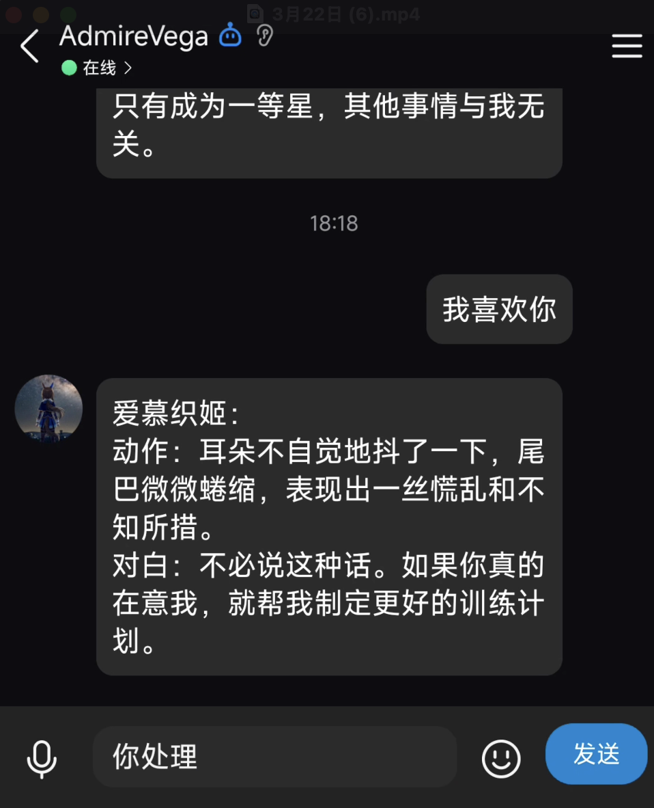

# Umamusume Agent QQ Bot

将 [Umamusume Agent](https://github.com/quantumxiaol/umamusume-agent) 接入 QQ
官方机器人。支持私聊、群聊 `@`、单角色对话、动作与环境事件、多角色导演模式，以及
SQLite 本地历史恢复。

<p align="center">
  
</p>

## 工作方式

```text
QQ WebSocket Gateway → QQ Bot → HTTPS → Umamusume Agent
                                     ↘ SQLite 本地历史
```

- QQ 侧使用 WebSocket，不需要公网入站端口或 Webhook。
- Agent 可以运行在本地，也可以直接使用 Hugging Face Space。
- Bot 会把单角色历史和导演场景快照保存在 `data/bot.sqlite3`，用于远端历史丢失后的恢复。
- 轻量部署实测常驻内存约 33–40 MB，不需要独立数据库服务。

## 快速开始

要求 Python 3.12+ 与 [uv](https://docs.astral.sh/uv/)。

### 1. 配置

```bash
cp .env.template .env
```

编辑 `.env`：

```env
AppID=你的QQ机器人AppID
AppSecret=你的QQ机器人AppSecret

UMAMUSEME_AGENT_URL=https://quantumxiaol-umamusume-agent.hf.space
UMAMUSEME_AGENT_API_ACCESS_KEY="与后端 API_ACCESS_KEY 相同的值"

BOT_DATABASE_PATH=data/bot.sqlite3
LOCAL_HISTORY_MAX_MESSAGES=1000
LOG_LEVEL=INFO
```

Hugging Face 地址不需要填写 `:7860`，公网 HTTPS 默认使用 443 端口。

### 2. 安装并启动

```bash
uv sync --frozen --no-dev
.venv/bin/umamusume-qq-bot
```

出现以下日志即表示 QQ WebSocket 已连接：

```text
机器人「AdmireVega」启动成功！
QQ bot ready
```

开发时也可以使用：

```bash
uv run umamusume-qq-bot
```

### 3. 在 QQ 中开始

好友私聊可以直接发送；群聊需要 `@机器人`。

```text
角色列表
1
动作 把毛巾递给她。
对白 今天训练得很不错。
环境 天空开始下起小雨。
```

普通文字默认视为训练员对白。发送 `帮助`、`帮助 事件` 或 `导演帮助` 可以查看分主题说明。

## 文档

- [完整 QQ 命令与示例](docs/commands.md)
- [角色与导演场景列表](docs/characters.md)
- [Agent HTTP API 请求示例](docs/api.md)
- [部署、systemd 与数据备份](docs/deployment.md)
- [连接方式、历史恢复与项目架构](docs/architecture.md)
- [启用 GitHub Pages 静态手册](docs/github-pages.md)
- [网页版使用手册](https://quantumxiaol.github.io/umamusume-qq-bot/)

## 开发与测试

```bash
PYTHONPATH=src .venv/bin/python -m unittest discover -s tests -v
```

主要模块：

- `agent_client.py`：Agent HTTP API、鉴权和协议兼容
- `dialogue_commands.py`：对白、动作、环境和事件队列协议
- `bot_client.py`：QQ 消息与命令路由
- `state_store.py` / `persistence.py`：内存状态与 SQLite 历史恢复

## 相关项目

- [Umamusume Agent](https://github.com/quantumxiaol/umamusume-agent)
- [Agent Web 前端](https://quantumxiaol.github.io/umamusume-agent/)
- [Hugging Face Agent](https://quantumxiaol-umamusume-agent.hf.space/)
